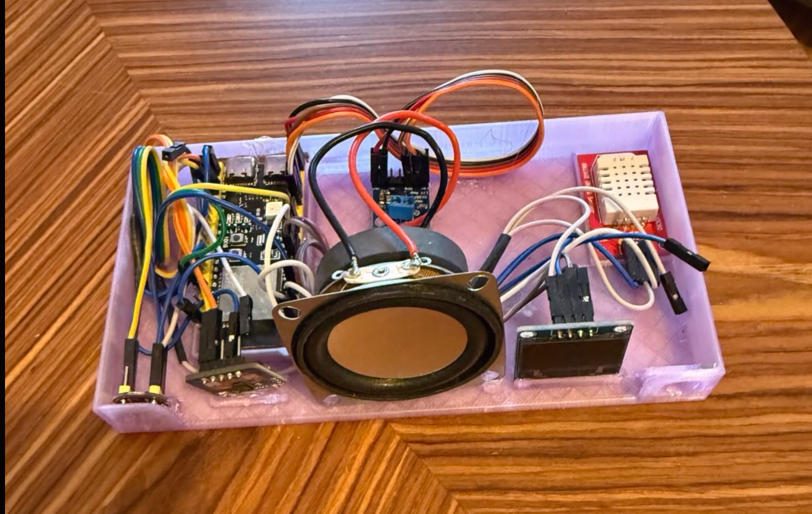

# hall-9

Local voice assistant for Home Assistant, running on ESPHome with Hall-9 hardware.

Local/offline STT/TTS with wake word on ESP32-S3.

## Hardware



### Hardware Parts

- ESP32-S3
- MAX98357 amplifier + speaker (4 Ω / 8 Ω)
- INMP441 microphone
- SSD1306 display
- DHT22 thermometer (optional)

### Bench Case

Use the bench case in `assets/case/` during development.

### Wiring

Follow the pinout from `hall-9.yaml`. Provide 5 V for the MAX98357; some ESP32-S3 boards can supply this directly.

## Install

Minimal ESPHome package stub for Home Assistant or the ESPHome Device Builder:

```yaml
substitutions:
  device_name: hall-9
  device_friendly_name: Hall 9

packages:
  hall9:
    url: https://github.com/chriopter/hall-9
    ref: dev
    files: [hall-9.yaml]

api:
  encryption:
    key: "YOUR_API_KEY"

ota:
  - platform: esphome
    password: "YOUR_OTA_PASSWORD"

wifi:
  ssid: !secret wifi_ssid
  password: !secret wifi_password
  ap:
    ssid: "Hall-9 Fallback Hotspot"
    password: "YOUR_FALLBACK_PASSWORD"

captive_portal:
```

<details>
<summary>Development</summary>

Local compile via the official ESPHome Docker image — no Python/ESPHome install needed.

1. Create `secrets.yaml` in the repo root (gitignored):

   ```yaml
   wifi_ssid: "YourSSID"
   wifi_password: "YourPassword"
   ```

2. Create a local wrapper, e.g. `hall-9.local.yaml` (gitignored):

   ```yaml
   substitutions:
     device_name: hall-9
     device_friendly_name: Hall 9

   esphome:
     name: ${device_name}
     friendly_name: ${device_friendly_name}

   packages:
     hall9: !include hall-9.yaml

   api:
     encryption:
       key: "REPLACE_WITH_BASE64_KEY"

   ota:
     - platform: esphome
       password: "REPLACE_WITH_OTA_PASSWORD"

   wifi:
     ssid: !secret wifi_ssid
     password: !secret wifi_password
     ap:
       ssid: "Hall-9 Fallback Hotspot"
       password: "REPLACE_WITH_AP_PASSWORD"

   captive_portal:
   ```

3. Compile:

   ```bash
   docker run --rm -v "$PWD":/config esphome/esphome compile hall-9.local.yaml
   ```

4. Flash — OTA over WiFi:

   ```bash
   docker run --rm --network=host -v "$PWD":/config esphome/esphome run hall-9.local.yaml --device <device-ip>
   ```

   Or via USB serial:

   ```bash
   docker run --rm --device=/dev/ttyACM0 -v "$PWD":/config esphome/esphome run hall-9.local.yaml
   ```

First run pulls the ESP-IDF toolchain (~2–3 GB). Build artifacts land in `.esphome/` (gitignored).

Optional hardware (DHT22, SSD1306 display) is wired via `packages:` in `hall-9.yaml` — comment out a line there to disable.

</details>

## Credits

Inspired by [esphome/home-assistant-voice-pe](https://github.com/esphome/home-assistant-voice-pe) — Home Assistant Voice Preview Edition.
